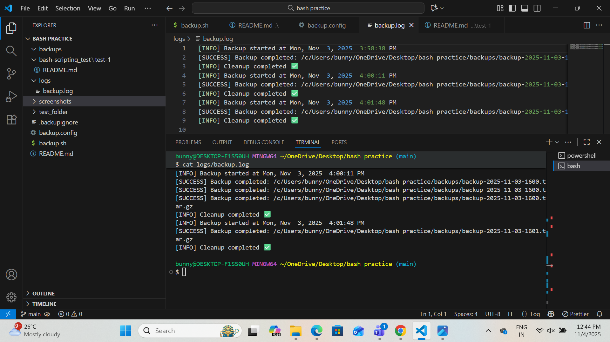

# Automated Backup System

● The Automated Backup File System is a simple tool that automatically creates backups of your important files and folders. It saves each backup with the date and time, so you always know when it was made. The system also removes old backups after a certain number of days to keep your storage clean.

# A Complete Automated Backup System

## A Bash script (backup.sh) that:

● Creates compressed .tar.gz backup files.

● Uses timestamp-based naming.

● Handles errors and validation.

● Logs all events into separate log files.

● Supports a retention policy for old backups.

### A Configurable Backup System:

● A dedicated configuration file (backup.config) where you can customize:

● Source directory.

● Backup storage directory.

● Log file paths.

● Retention days.

● Optional dry-run mode.

### Organized Backup Storage Structure:

● A proper folder structure that stores all backups in:

```
backups/
└── backup-YYYY-MM-DD-HHMM.tar.gz
```

Each backup is clearly named and easy to restore.

### Logging System:

● A detailed logging mechanism that generates:

```
logs/
├── backup.log
└── error.log
```

These logs help track backup history, troubleshoot issues, and verify success.

### Retention Cleanup System:

● A cleanup mechanism that:

● Finds old backup files.

● Deletes them based on retention days.

● Logs the cleanup process.

● This prevents unnecessary storage usage.

### A Safe Dry Run Mode:

● A simulation mode (--dry-run) that shows everything the script would do 

without making changes.

● Perfect for testing configuration and verifying paths.

 ### Cron Job–Ready Automation:

● A backup process that can be scheduled automatically using:

● crontab -e

# A. What Your Script Must Do:

## Create Backups:

### 1️.Make the Script Executable

```
chmod +x backup.sh
```

### 2.Create a Backup Manually

```
./backup.sh
```

● When you run this, the script will:

● Validate the source folder.

● Generate a timestamped filename.

● Create a .tar.gz backup archive.

● Save it inside the backups/ folder.

● Log the result in logs/backup.log.

## Delete Old Backups:

### 1.Set Retention Days in backup.config

● In your configuration file, set how many days you want to keep backups:

```
RETENTION_DAYS=7
```

### 2.Folder Structure After Retention

```
backups/
├── backup-2025-11-20-1100.tar.gz
└── backup-2025-11-21-1420.tar.gz
```

## Check If Backups Are Good(Vreification):

### 1.List the Contents of a Backup File

● This checks whether the .tar.gz archive is readable and not corrupted:

```
tar -tzf backups/backup-YYYY-MM-DD-HHMM.tar.gz
```

### 2.Test Extract the Backup (Without Extracting Files)

● Use the -W flag to check_tar integrity:

```
tar -tzf backups/backup-YYYY-MM-DD-HHMM.tar.gz > /dev/null
```

● No output = GOOD

● Error message = BAD backup

### 3.Verify Backup File Size

● A zero-byte or very small backup file usually means something went wrong:

```
ls -lh backups/
```

● Reasonable file size

● Consistency across multiple backups

# B.Logging

## Log File Structure

```
logs/
├── backup.log
└── error.log
```

## 1. backup.log (Activity Log)

● This file stores a detailed history of all backup operations, including:

● When the backup started.

● Which file was created.

● Timestamp of the archive.

● Retention cleanup actions.

● Successful operations.

● Warnings

# 2. error.log (Error Log)

● This file captures only errors, including:

● Missing or invalid directories.

● Permission issues.

● Failure to create backup.

● Failed retention cleanup.

● Tar/compression errors.

# C.Prevent Multiple Runs

● To avoid conflicts, corrupted backups, or high system load, the backup 

script must ensure that only one instance runs at a time.

## This prevents problems such as:

● Two backups running simultaneously

● Cron jobs overlapping

● File locks during compression

● Duplicate log entries

● Incomplete or corrupted backups

# 1.Your Code

## Project Structure

```
automated-backup-system/
├── backup.sh                      # Main backup automation script
├── backup.config                  # Configuration file (source, destination, retention)
│
├── backups/                       # Auto-generated backup archives
│   ├── backup-2025-11-21.tar.gz
│   └── ...
│
├── logs/                          # Log files
│   ├── backup.log                 # Full history of backups
│   └── error.log                  # Critical errors
│
├── screenshots/                   # Screenshots for documentation
│   ├── backup-success.png
│   └── folder-structure.png
│
├── tests/
│   ├── test_backup.sh             # Test script for backup process
│   └── test_config.sh             # Tests configuration behavior
│
├── .gitignore
└── README.md

```

---

# 2.README.md Must Includes

## A. Project Overview

● The Automatic Backup File System is a lightweight, configurable, and fully

automated backup solution designed to safely archive important files and

directories on a Linux system. Built entirely in Bash scripting, it

provides a reliable method for creating timestamped backups, maintaining 

logs, handling errors, and applying retention policies — all without manual

intervention.

● This project is ideal for system administrators, DevOps engineers,

developers, or anyone who needs a simple yet powerful backup mechanism.

# B. How to Use It:

### 1️.Clone the Project

● git clone https://github.com/your-username/automated-backup-system.git

cd automated-backup-system

### 2.Update the Configuration File

#### Open backup.config and set your desired values:

● nano backup.config

### 3.Make the Script Executable

● chmod +x backup.sh

### 4️.Run the Backup Manually

● ./backup.sh

### 5️.Automate Backups with Cron (Recommended)

#### Open the cron editor:

● crontab -e

### 6.Check Your Backups

Your backup files will be stored here:

```
backups/
├── backup-2025-11-21.tar.gz
├── backup-2025-11-22.tar.gz
└── ...
```

● Each file is automatically timestamped for easy sorting and tracking.

### 7️.View Logs

#### Log files are stored under:

```
logs/
├── backup.log
└── error.log
```


### 8️.Clean Old Backups (Automatic)

● The script deletes backups older than the number of days set in 

RETENTION_DAYS

● You do not need to do anything — cleanup happens automatically.

# C. How It Works:

### 1.Backup Creation:

* The script uses the `tar` command to compress files into `.tar.gz`.
* Excluded patterns (like `.git` or `node_modules`) are skipped.
* Each backup is named using date and time:

  ```
  backup-2025-11-03-1430.tar.gz
  ```

###  2.Checksum Verification:

After creation, the script generates a SHA256 checksum:

```
sha256sum backup-2025-11-03-1430.tar.gz > backup-2025-11-03-1430.tar.gz.sha256
```

Then verifies it to ensure data integrity.

###  3.Backup Retention Policy:

Old backups are automatically deleted:

* Keep **7 daily**, **4 weekly**, and **3 monthly** backups.
* The script lists files by date and removes older ones beyond the retention limits.

###  4.Lock Mechanism:

Prevents accidental double runs using:

```
/tmp/backup.lock
```

---

# D. Design Decisions:

###  Design Decisions

| Feature          | Reason                                          |
| ---------------- | ----------------------------------------------- |
| `.tar.gz` format | Universally supported and efficient             |
| SHA256 checksum  | Strong integrity verification                   |
| Config file      | Easier customization without editing the script |
| Dry-run mode     | Safe testing before running backups             |
| Lock file        | Avoids corrupted or overlapping backups         |


### 1. Modular Project Structure

#### The system is separated into:

● backup.sh → Core script with backup logic

● backup.config → User-defined settings (paths, retention, schedule)

● backups/ → Central storage for backup archives

● logs/ → (Optional) To store backup logs

### 2. Configuration-Driven Workflow

● All dynamic values (backup paths, filename patterns, retention days, 

exclusion rules) are stored in backup.config.

### 3. Use of Standard Linux Tools

#### The script uses widely available Unix tools such as:

● tar → archive creation

● rsync → efficient file sync (optional)

● cron → automated scheduling

● gzip → compression

● date → timestamp generation

### 4. Timestamp-Based Backup Files

#### Backup filenames use the pattern:

● backup-yyyy-mm-dd_HH-MM-SS.tar.gz

### 5. Logging & Error Handling

#### The system logs:

● Backup start and end time

● Files included

● Success or failure status

● Total archive size

### 6. Retention Policy (Automatic Cleanup)

● Old backups are deleted based on a retention period defined in the config.


# Configuration — backup.config:

### All settings can be configured in the backup.config file.

Example:

### Directory to back up

SOURCE_DIR="/path/to/source"

### Backup output directory

DEST_DIR="./backups"

### Logging

LOG_FILE="./logs/backup.log"

ERROR_LOG="./logs/error.log"

### Days to retain old backups

RETENTION_DAYS=7


# Screenshots:

### Below screenshots are included inside the screenshots/ folder:

● backup-success.png – Example terminal output

● folder-structure.png – Folder layout preview

# E. Testing:

### Run test scripts:

● bash tests/test_backup.sh

● bash tests/test_config.sh

# F. Known Limitations:

#### 1. No Incremental or Differential Backups

● The system creates full backups only, which can be slower and consume more storage for very large directories.

● Incremental backups (like rsync-based) are not currently implemented.

#### 2. No Built-in Encryption

● Backup archives are not encrypted.

● If encryption is needed, external tools such as gpg or openssl must be added manually.

#### 3. Limited Error Recovery

● The script logs errors but cannot automatically recover from:

● Permission issues.

● Missing directories.

● Low disk space.

● Interrupted backup processes.

#### 4. Designed Primarily for Linux/macOS

● Windows is not natively supported unless using:

● Git Bash.

● WSL (Windows Subsystem for Linux).

● Cygwin.

#### 5. Retention Policy Is Time-Based Only

● Old backups are deleted based on the number of days.

● No support yet for:

● Maximum file size.

● Maximum count.

● Smart cleanup logic.

#### 6. No Backup Verification Step

● After compression, the system does not:

● Verify archive integrity.

● Check file consistency.

● Validate restore compatibility.

#### 7. No Email or Alert Notifications

● The script does not currently send email or system alerts on:

● Backup success.

● Backup failure.

● Low disk space.

# 3.Examples You Must Show:

## Creating a Backup

The Automatic Backup File System makes it simple to manually create a backup or run it automatically using a scheduler.
Follow the steps below to generate a backup safely and efficiently.

### 1️.Ensure Configuration Is Set Correctly

#### Before creating a backup, verify the settings in backup.config:

SOURCE_DIR="/path/to/source"
DEST_DIR="./backups"
LOG_FILE="./logs/backup.log"
ERROR_LOG="./logs/error.log"
RETENTION_DAYS=7

### 2️.Make the Script Executable

#### Run this once:

● chmod +x backup.sh

### 3️.Run the Backup Manually

#### Use the command:

● ./backup.sh

A compressed .tar.gz file will be created inside the backups/ directory.

Example:

backups/
└── backup-2025-11-21-1420.tar.gz

### 4️.Verify Logs

#### Check the backup history:

● cat logs/backup.log


Check error logs:

● cat logs/error.log


You will see entries such as:

[2025-11-21 14:20:01] Backup created: backup-2025-11-21-1420.tar.gz

### 5️.Scheduled Backups (Optional)

● To automate daily backups, use cron.

#### Open cron editor:

● crontab -e


Run backup daily at 2 AM:

0 2 * * * /path/to/backup.sh

### 6️.Restoring from a Backup

#### To restore files:

● tar -xzf backups/backup-2025-11-21-1420.tar.gz -C /restore/location.

## Dry Run Mode

● The Dry Run Mode allows you to simulate the backup proces without actually

creating any backup files, deleting old backups, or modifying your system.

It is useful for testing your configuration, verifying folder paths, and 

previewing actions before running a real backup.

● Dry Run Mode ensures everything is set correctly without risking any 

changes.

### How to Enable Dry Run Mode:

#### Add this line inside your backup.config:

● DRY_RUN=true

Or run manually:

● ./backup.sh --dry-run

#### Example Dry Run Output:

[DRY RUN] Backup process started...

[DRY RUN] Would create archive: backup-2025-11-22-1010.tar.gz

[DRY RUN] Would save to: backups/

[DRY RUN] Would remove old backups older than 7 days

[DRY RUN] DRY RUN MODE ACTIVE - No changes were made.


## Backup Workflow:

#### The automated backup process follows:

1.Load configuration

2.Validate source/destination paths

3.Generate timestamped filename

4.Create compressed archive

5.Log the operation

6.Clean old backups based on retention days

7.Output success message

##  Future Improvements

* Add automatic email notifications.
* Implement incremental backups using `rsync`.
* Store logs in `backup.log` with timestamped entries.
* Add compression-level configuration.

---

##  Features

● Create timestamped compressed backups.
 
● Verify backup integrity (checksum validation).
 
● Automatically delete old backups based on retention rules.
 
● Configurable backup destination and exclusions.
 
● Lock mechanism to prevent multiple simultaneous runs.
 
● Dry-run mode (safe simulation).
 
● Simple configuration via `backup.config`.


##  Example Log Output Screenshot:



##  Author

Bunny Kukkunoori

Developer & Automation Engineer

Email: bunnykukkunoori@gmail.com

GitHub: bunnykukkunoori-wq

---


